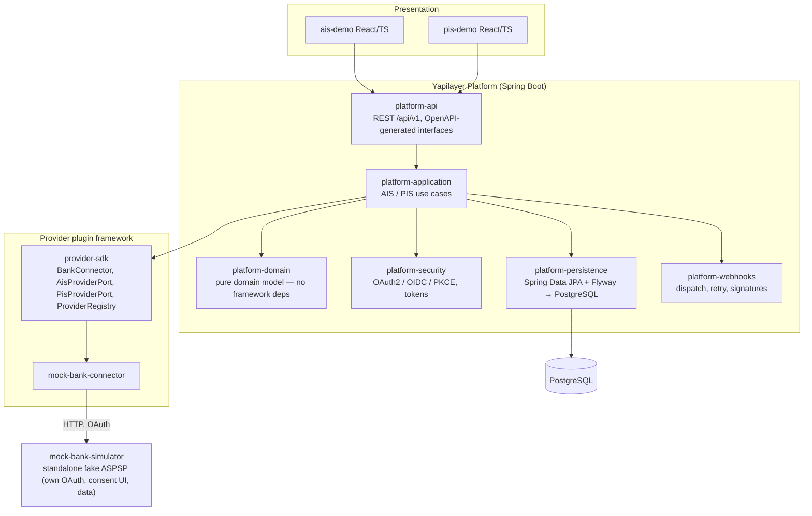
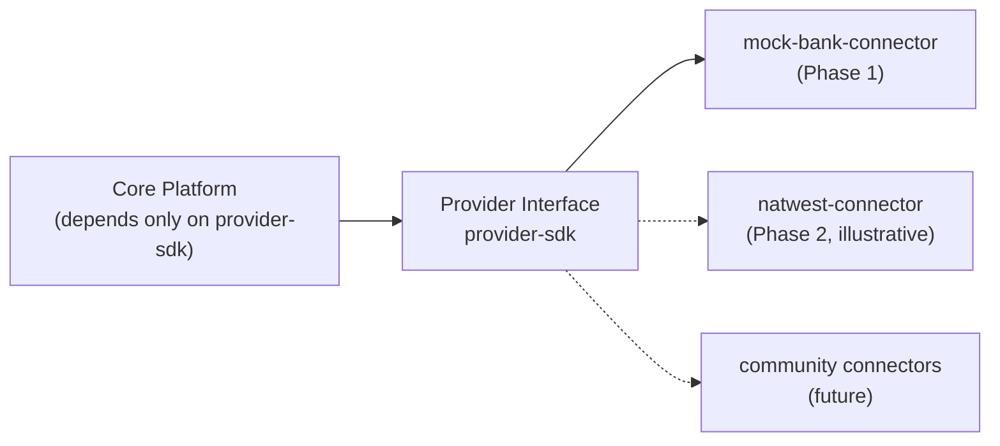

# Architecture

## Overview

Yapilayer is a modular Open Banking platform: a core that exposes stable AIS/PIS APIs, and a plugin framework through which bank connectors provide the actual connectivity. Bank-specific logic never enters the core (ENGINEERING_STANDARDS §3.3).

## Layered structure

Each layer is a separate Gradle module; dependency direction is enforced at compile time (ADR 0001).

## Provider plugin model

Adding a bank = adding a connector module that implements the `provider-sdk` ports and declares its capabilities (ADR 0004). No core changes.

## Key invariants

- `platform-domain` has zero framework dependencies — the build fails if Spring leaks in.
- Core platform modules depend on `provider-sdk` only, never on a concrete connector.
- `mock-bank-simulator` is a separate process from the connector, so connector code crosses a real network/OAuth boundary (ADR 0003).
- The OpenAPI spec (`openapi/yapilayer-api.yaml`) is the source of truth; server interfaces and SDKs are generated from it (ADR 0005).

## Prior art & positioning

Per PRODUCT_REQUIREMENTS §17, commercial platforms are studied as benchmarks, not copied:

- **Yapily** — API-only aggregation (no UI layer); closest in spirit to Yapilayer's headless platform core. Benchmark for provider breadth and raw API design.
- **TrueLayer** — strong payments focus and developer experience; benchmark for the PIS journey and DX polish.
- **Plaid** — benchmark for onboarding flow and SDK ergonomics (Link-style drop-in is a possible future demo pattern).
- **Tink** — benchmark for European multi-market architecture, relevant to the Phase 3 PSD2 expansion.

Yapilayer's differentiator is not feature parity — it is that the platform is open source, self-hostable, and extensible via community connectors, with no commercial middleware dependency (Constitution §2).

## Status

Living document — updated at every milestone. Current as of Milestone 0 (genesis).
